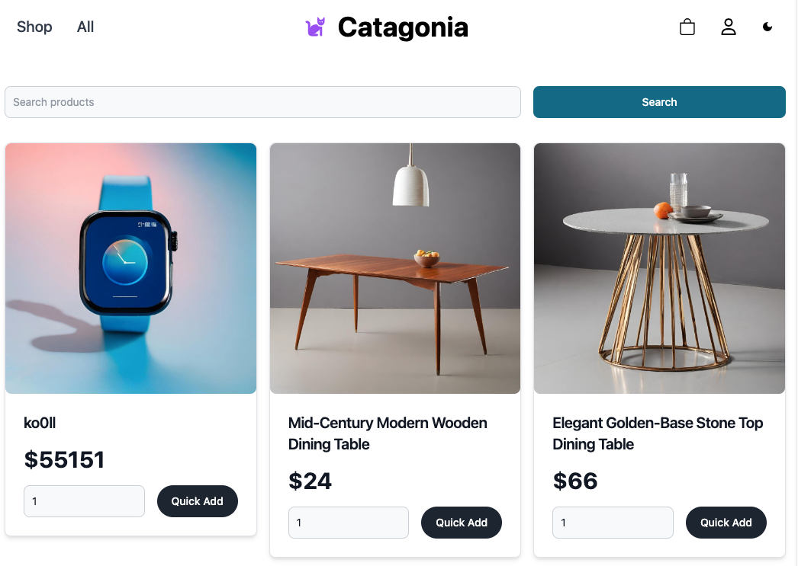
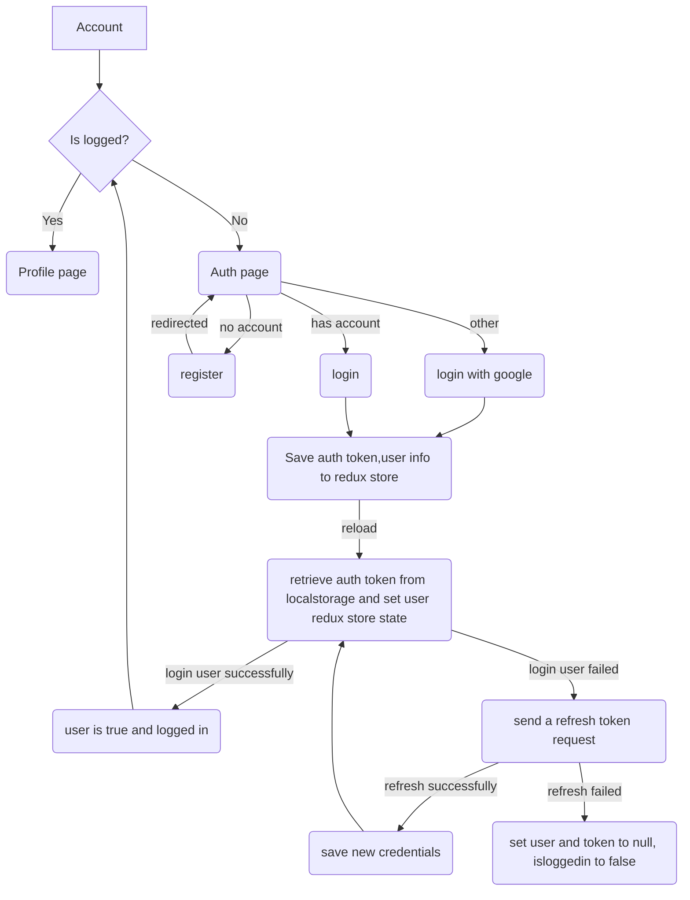
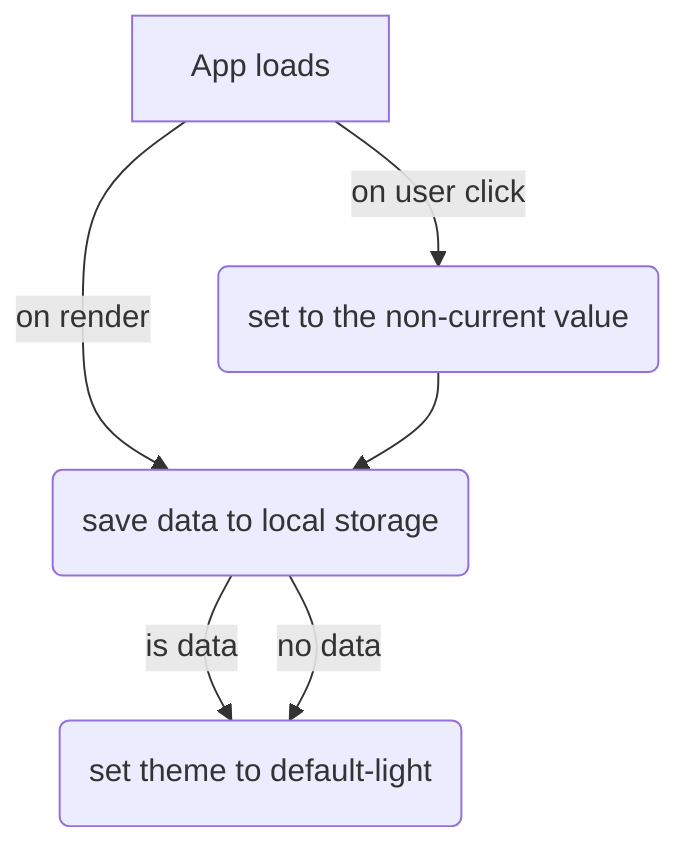
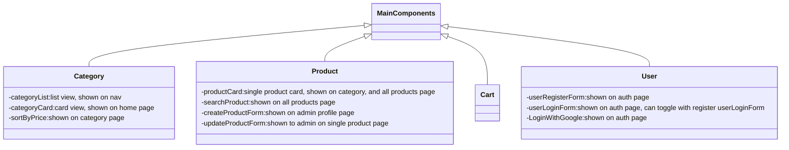
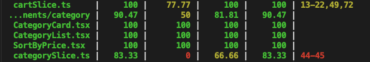

## Introduction
This project is a frontend e-commerce application using the [fake store api](https://fakeapi.platzi.com/). 

You can find it live here: **[Catagonia](https://fs17-frontend-project-mauve.vercel.app/)**



This project is meant for practing and learning purposes. 

### Technologies:
- React
- TypeScript
- Redux Toolkit
- RTK Query
- Tailwind CSS
- Flowbite
- Flowbite React
- React Hook Form
- React Testing Library
- Jest
- Notistack
- React Router Dom

## Getting started
### Prerequisites
- Node.js
- npm or yarn
- git
### Installation
1. Clone the repository
```bash
git clone git@github.com:actuallyyun/frontend-project.git
```
2. Install dependencies

```bash
yarn install
```
3. Setup the enviroment

The project implements login with google function. You have to acquire a google client id and add it to the `.env` file. Please write to [Yun Ji](this.jiyun@gmail.com) for the API credentials.


4. Start the development server

```bash
yarn start
```

To run test, use the following command:

```bash
yarn test
```

## Overview

This project adopts a [Clean Architecture](https://blog.cleancoder.com/uncle-bob/2012/08/13/the-clean-architecture.html) approach, so you could find the first basic elements:

### UI layer
- **Components**: This folder contains the basic UI elements. You should add any UI element inside this folder, with it's logic and the respective CSS file module(if needed).Each component resides next to its data flow logic, and it's test file.

- **Pages**: This folder contains the main pages of the application. Each page should have its own folder.

### Service layer
This is the layer that communicates the application with the outer world, and the one that would be coupled with almost any 3rd party provider, framework, etc. In this case, the service layer is implemented with RTK Query, which is a powerful data fetching and caching tool.

### `misc` folder
type, utility functions, and other miscellaneous files are stored here.

### `test` folder
Reusable test utilities and custom render functions are stored here.

## Data flow

### User auth data flow



### useContext theme data flow



## Component structure



### Pages Overview

- Home `./`
- Auth `./auth`
- Profile `./account` **Private route**. Only logged in users can access this page.
- Cart `./cart`
- Single product page `./product/:id`
- Category page `./shop/id`
- All products page `./product`


### Testing
The project uses `react testing library` and `jest` for unit testing. 

To run the tests, use the following command:
```bash 
yarn test
```
1. Unit testing for RTK queries


*auth and product api tests 91-92% coverage*

2. Unite testing for reducers


*User reducer tests 89.65% coverage*


*Cart and category slice tests - 100% test coverage*

3. Unit testing for utility functions


*Utility functions tests-90% test coverage*

4. Unit testing for components


*Key logic in components are tested*

## Deployment
The project is deployed on Vercel. The deployment is automated, so any push to the main branch will trigger a new deployment.
Remember to set the environment variables in the Vercel dashboard.Do not add quotation marks to the values.


## Disclaimer & Acknowledgements
This project is created for educational purposes only. It is not intended for commercial use.

It is part of the [Integrify Finland Full stack web development program](https://www.integrify.io/) and is created and instructed by Anh Nguyen. Big thanks to her and the Integrify team for the support and guidance.